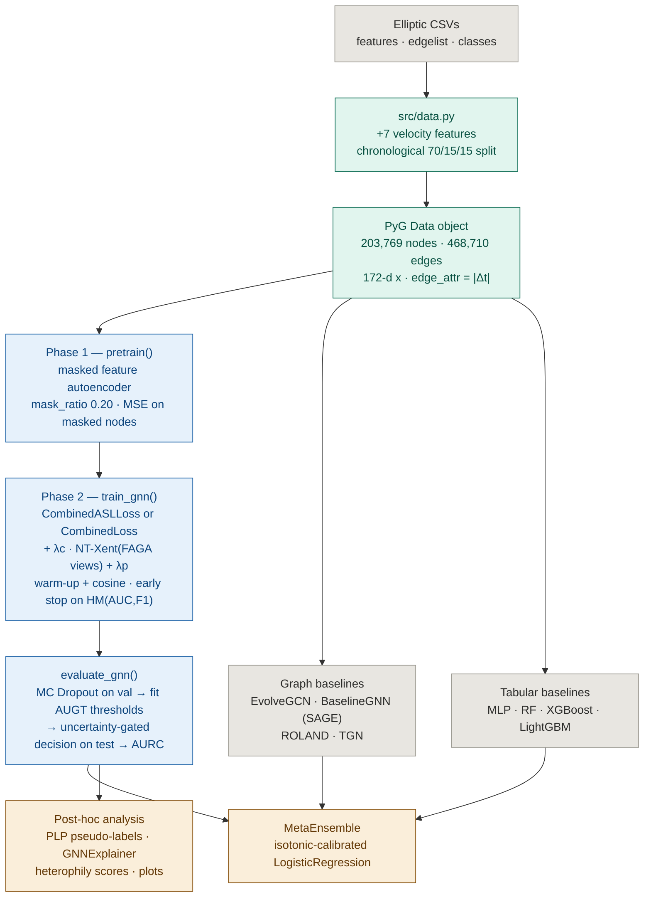
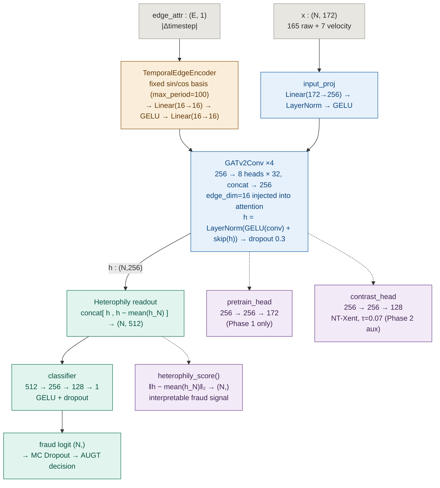

<div align="center">

[](https://github.com/ria0304/Bitcoin-Transaction-Fraud-Detection-)


# ElliGAT — Bitcoin Transaction Fraud Detection

**Heterophily-aware graph attention network for illicit transaction detection.**

ElliGAT is a GATv2-based model built for the [Elliptic Bitcoin Dataset](https://www.kaggle.com/datasets/ellipticco/elliptic-data-set), designed around three properties of the underlying blockchain graph that generic GNNs handle poorly: heterophily, class imbalance, and temporal drift.

</div>

---

## Status

The core ElliGAT + MetaEnsemble pipeline below is trained and verified end-to-end on the full Elliptic dataset (5 seeds, GPU run, log in `run_log_final.txt`). A second set of four "novel contribution" modules (FAGA, AUGT, PLP, GNNExplainer) plus an alternate loss have since been added to `src/` — they are implemented and unit-checked on synthetic data, but **have not yet completed a full run on the real dataset** in this environment (see [Novel Extensions](#novel-extensions-unverified-on-real-data) for exactly why, and what "verified" means here). Numbers below are reported only where a real run backs them.

---

## The Problem

Cryptocurrency networks like Bitcoin operate without a central authority, making them attractive for money laundering, ransomware payments, and other illicit activity. Detecting fraud in these networks is hard for three reasons:

**1. The graph is heterophilous.**
Illicit nodes are rarely clustered together. Fraudsters deliberately route transactions through legitimate wallets (mixing, layering), so a fraud node is typically surrounded by licit neighbours. Standard GNNs aggregate neighbour messages and average away exactly the signal that distinguishes fraud.

**2. The data is severely imbalanced.**
Only ~9.76% of labelled transactions are illicit. Models that optimise AUC alone can score well while missing most actual fraud — the minority class that matters.

**3. The graph evolves over time.**
The dataset spans 49 timesteps. A model that ignores temporal structure treats edges from different periods as equivalent, losing transaction velocity and sequence information.

---

## Blockchain Data Provenance

ElliGAT trains on the **Elliptic dataset**, a graph *derived* from the real Bitcoin blockchain by Weber et al. (2019) — not on raw chain data directly.

1. **Blocks → Transactions.** The Bitcoin blockchain is an append-only, hash-linked sequence of blocks; each block contains transactions confirmed at that point in time.
2. **Transactions → UTXO graph.** Every transaction consumes prior unspent outputs (inputs) and creates new ones (outputs). Following these links produces a directed graph of payment flows — the UTXO graph.
3. **UTXO graph → Node/edge graph.** Elliptic samples 203,769 transactions as **nodes** and 234,355 directed payment flows (468,710 undirected) as **edges**. Each node carries 166 features derived from on-chain data plus locally-aggregated neighbourhood statistics, grouped into 49 timesteps (~2 weeks each) spanning roughly 3 years.
4. **Labels via forensic clustering.** ~22.9% of nodes are labelled licit/illicit, via address-clustering heuristics linked to known real-world entities (exchanges, mining pools vs. scams, ransomware, darknet markets).

The three properties ElliGAT is built around — heterophily, imbalance, temporal drift — are consequences of this pipeline, not artifacts of the dataset format: mixing produces heterophilous neighbourhoods, the rarity of confirmed illicit activity produces the ~9.76% imbalance, and the block-ordered structure is what makes the 49-timestep signal meaningful.

> **Note:** released Elliptic features are anonymised/derived, not raw address or amount data. See [Live On-Chain Inference](#live-on-chain-inference) for what that means for running ElliGAT on fresh transactions.

---

## Solution

**Heterophily-aware readout.** Appends the difference between a node and its neighbourhood mean to its embedding: `[h_i ∥ h_i − μ(h_Nj)]` — an explicit signal for how different a node is from its neighbours.

**Imbalance-robust training.** Focal Loss (α=0.80, γ=2.5) down-weights easy licit examples and focuses on hard fraud cases. Validation is selected on the harmonic mean of AUC and F1, not AUC alone, to avoid the common failure mode where F1 collapses on the minority class.

**Temporal edge encoding.** Each edge carries a 16-dimensional encoding of `|Δtimestep|`, letting GATv2 attention distinguish edges within a timestep from edges crossing large time gaps.

**Two-phase training.** Phase 1 self-supervised pre-training (masked feature autoencoder, mask ratio 0.20) initialises the model before Phase 2 fine-tunes with Focal Loss on labelled nodes.

**MetaEnsemble stacking.** An isotonic-calibrated logistic regression meta-learner stacks ElliGAT with XGBoost, LightGBM, RandomForest, and MLP. The GNN captures graph structure the tabular models can't see; the tabular models capture feature patterns the GNN misses.

---

## Results (verified)

Averaged over **5 random seeds** (42, 123, 2024, 17, 99), chronological 70/15/15 split, full GPU run (`run_log_final.txt`, root). EvolveGCN numbers are cited from the original paper (Pareja et al., 2020) — not reproduced here due to GPU memory constraints.

| Model | ROC-AUC | F1 | MCC |
|---|---|---|---|
| MLP | 0.9673 ± 0.0068 | 0.8206 ± 0.0047 | 0.8167 ± 0.0062 |
| RandomForest | 0.9894 ± 0.0007 | 0.8441 ± 0.0021 | 0.8405 ± 0.0031 |
| XGBoost | 0.9907 ± 0.0010 | 0.8508 ± 0.0147 | 0.8419 ± 0.0180 |
| LightGBM | 0.9917 ± 0.0001 | 0.8770 ± 0.0038 | 0.8716 ± 0.0049 |
| EvolveGCN (cited) | ~0.940 | ~0.720 | — |
| BaselineGNN (3-layer GAT) | 0.9250 ± 0.0039 | 0.7738 ± 0.0060 | 0.7672 ± 0.0070 |
| **ElliGAT (ours)** | **0.9468 ± 0.0054** | **0.7925 ± 0.0104** | **0.7837 ± 0.0108** |
| **MetaEnsemble (ours)** | **0.9870 ± 0.0014** | **0.8629 ± 0.0038** | **0.8570 ± 0.0037** |

**ElliGAT vs EvolveGCN (cited):** +7.3% F1, +0.68% AUC
**MetaEnsemble vs EvolveGCN (cited):** +14.3% F1, +4.7% AUC

> Precision: 0.8976 ± 0.0112 | Recall: 0.7096 ± 0.0131 | Balanced Acc: 0.8514 ± 0.0066
> Graph: 203,769 nodes · 468,710 undirected edges · 172 features/node

`main.py` also instantiates two further temporal-graph baselines, **ROLAND** (Wang et al., 2022) and **TGN** (Rossi et al., 2020), in `src/baselines.py`. They were added after the verified run and have no results row yet.

These numbers were produced with `LOSS_NAME=focal` **and** the legacy `mlp` edge encoder. Both are no longer the defaults: `configs/config.py` now ships `LOSS_NAME=asymmetric` and `EDGE_ENCODING=sinusoidal`. To reproduce this exact table, set `LOSS_NAME=focal EDGE_ENCODING=mlp`. The sinusoidal encoder is a genuine architecture change and has no results row yet — it is untested against this baseline.

---

## Architecture

### System pipeline



### ElliGAT model internals



### Layer reference

| Stage | Component | Shape / config |
|---|---|---|
| Input | Node features | `(N, 172)` — 165 raw + 7 velocity |
| Input | Edge features | `(E, 1)` — `\|Δtimestep\|` |
| Edge encoder | `TemporalEdgeEncoder` | **sinusoidal** (default): fixed sin/cos basis on `\|Δt\|`, `max_period=100` → `Linear(16→16) → GELU → Linear(16→16)`<br/>**mlp** (legacy): `Linear(1→16) → GELU → Linear(16→16)` |
| Encoder | `input_proj` | `Linear(172→256) → LayerNorm → GELU` |
| Encoder | `GATv2Conv × 4` | `256 → 8 heads × 32 (concat)`, `edge_dim=16`, `dropout=0.3`, residual via `Linear(256→256, bias=False)` + `LayerNorm` |
| Readout | Heterophily concat | `(N, 512)` = `[h ∥ h − μ(h_N)]`, neighbour mean via degree-normalised `scatter_add` |
| Head | `classifier` | `512 → 256 → 128 → 1`, GELU + dropout |
| Aux head | `pretrain_head` | `256 → 256 → 172` (Phase 1 reconstruction) |
| Aux head | `contrast_head` | `256 → 256 → 128` (NT-Xent, τ = 0.07) |
| Signal | `heterophily_score()` | `(N,)` L2 norm of the difference term |

### Training protocol

```
Phase 1 — pretrain()                     src/trainer.py
  • Mask 20% of node features to zero, encode, reconstruct via pretrain_head
  • MSE on masked nodes only · warm-up + cosine LR

Phase 2 — train_gnn()                    src/trainer.py
  • loss_name = "asymmetric" (config default) → CombinedASLLoss
    loss_name = "focal"                       → CombinedLoss   ← verified Results table
  • + λc · NT-Xent over two FAGA views (src/augmentation.py::augment_pair)
  • + λp · pre-train reconstruction term
  • Early stopping on HM(AUC, F1), patience 30, max 300 epochs

Evaluation — evaluate_gnn()              src/trainer.py
  • MC Dropout (n=20) on val → per-node mean prob + uncertainty
  • fit_augt_thresholds(base_low, base_high, k) on val
  • Uncertainty-gated decision rule on test → metrics + AURC / coverage
  • Falls back to a static grid-searched threshold if val has one class only

Phase 3 (post-hoc) — run_plp()           src/pseudo_label.py
  • MC Dropout over all nodes → pseudo-label confident unlabelled nodes
  • Re-train with down-weighted pseudo-label loss
```

### Temporal edge encoding

`TemporalEdgeEncoder` supports two modes, selected by `EDGE_ENCODING` in
`configs/config.py` (or the env var of the same name):

| Mode | Encoding | Use |
|---|---|---|
| `sinusoidal` *(default)* | Fixed Transformer-style sin/cos basis on the scalar `\|Δt\|`, then a learned 2-layer projection | Gives the attention mechanism a smooth, multi-scale view of the temporal gap for free — fast-varying channels separate Δ=0 from Δ=1 (within- vs adjacent-timestep edges), slow-varying channels separate short from long temporal hops |
| `mlp` *(legacy)* | `Linear(1→16) → GELU → Linear(16→16)` on the raw scalar | Reproduces the verified 5-seed results in the table above, which were produced with this path |

`max_period` defaults to **100**, not the NLP-standard 10000. Elliptic deltas
lie in `[0, 48]`; at `max_period=10000` the two highest-index channels vary by
less than `1e-3` across that entire range and contribute nothing, whereas at
100 all 16 channels stay informative.

> **One place where code and docstring still disagree, kept honest here:**
> `_heterophily_readout` aggregates over `edge_index` as stored (`row → col`),
> so on the undirected graph it is a symmetric neighbourhood mean, not a
> directional predecessor mean.

### MetaEnsemble

```
Base models : ElliGAT · EvolveGCN · BaselineGNN · ROLAND · TGN · MLP · RF · XGBoost · LightGBM
Stacker     : isotonic-calibrated LogisticRegression (5-fold CV) over base probabilities
```

---

## Novel Extensions (unverified on real data)

Four additional modules and an alternate loss live in `src/`, on top of the verified baseline above. Each is implemented and exercised on synthetic data, but **none has a completed run against the real Elliptic dataset in this repo's history** — `outputs/run_summary.txt` records the most recent full-pipeline attempt as blocked (dataset path not found, `xgboost`/`lightgbm` unavailable in that environment), and a later run (`outputs/run_log.txt`) loaded the real graph correctly but stopped after Phase 1 with no aggregated metrics logged. Treat everything in this section as implemented-but-not-yet-benchmarked, not as a result.

| Module | File | What it does |
|---|---|---|
| FAGA — Fraud-Aware Graph Augmentation | `src/augmentation.py` | Structure/feature-aware contrastive augmentation that avoids destroying minority-class signal, unlike random edge-drop/feature-mask on a heterophilous graph |
| AUGT — Adaptive Uncertainty-Gated Threshold | `src/uncertainty.py` | Per-node two-threshold abstention (`tau_low`, `tau_high`) driven by MC-Dropout uncertainty, replacing a single grid-searched threshold |
| PLP — Pseudo-Label Propagation | `src/pseudo_label.py` | Assigns pseudo-labels to the 77.1% of nodes with no ground truth, using MC-Dropout confidence, then re-trains with a down-weighted pseudo-label loss (Phase 3) |
| GNNExplainer attribution | `src/explain.py` | Applies GNNExplainer to trained ElliGAT to attribute predictions to subgraphs/features, reporting Fidelity+/Fidelity− |
| ASL — Asymmetric Loss | `src/losses.py`, `configs/config.py` | Alternate to Focal Loss (`gamma_pos=0.0, gamma_neg=4.0, clip=0.05`); currently the config default (`LOSS_NAME=asymmetric`) |

Ablation entry points exist for the graph/pseudo-label pieces but have not produced a saved results file yet:

```bash
python run_faga_ablation.py         # edge-drop / feature-mask ablations
python run_plp_ablation.py          # confidence threshold / lambda_pl / MC-sample ablations
python run_clean_reproduction.py    # full ElliGAT-J pipeline: FAGA + AUGT + PLP + GNNExplainer
```

To actually produce numbers for this section: set `BITCOIN_DATA_PATH` to a local Elliptic copy (or valid Kaggle credentials), `pip install xgboost lightgbm`, then run `run_clean_reproduction.py` end-to-end and let it finish — the current logs stop mid-Phase-1.

---

## Key Design Choices vs Baseline

| Feature | BaselineGNN | ElliGAT |
|---|---|---|
| Architecture | 3-layer GAT | 4-layer GATv2 |
| Edge features | None | Temporal Δtimestep encoding |
| Hidden dim / heads | 128 / 4 | 256 / 8 |
| Heterophily readout | None | [h ∥ h − μ(h_N)] |
| Pre-training | None | Masked feature autoencoder |
| Loss function | Cross-entropy | Focal Loss (α=0.80, γ=2.5) / Asymmetric (current default) |
| LR schedule | Cosine | Warm-up + Cosine |
| Validation criterion | AUC only | HM(AUC, F1) |
| Velocity features | 5 | 7 (adds 24h count + std) |

---

## Project Structure

```
Bitcoin-Transaction-Fraud-Detection-/
├── main.py                    ← Full pipeline entry point
├── run_clean_reproduction.py  ← Full ElliGAT-J run: FAGA + AUGT + PLP + GNNExplainer
├── run_faga_ablation.py       ← FAGA component ablations
├── run_plp_ablation.py        ← PLP component ablations
├── requirements.txt
├── configs/
│   └── config.py              ← All hyperparameters and paths (incl. LOSS_NAME switch)
├── outputs/                   ← run logs, run_summary.txt (gitignored checkpoints excluded)
└── src/
    ├── data.py                ← Dataset loading, feature engineering, graph builder
    ├── models.py              ← ElliGAT, EvolveGCN, BaselineGNN
    ├── losses.py              ← FocalLoss, AsymmetricLoss (ASL), CombinedLoss
    ├── trainer.py             ← Pre-training, fine-tuning, evaluation, MC Dropout
    ├── baselines.py           ← Tabular models + MetaEnsemble stacker
    ├── augmentation.py        ← FAGA — fraud-aware graph augmentation (unverified)
    ├── uncertainty.py         ← AUGT — uncertainty-gated abstention thresholds (unverified)
    ├── pseudo_label.py        ← PLP — pseudo-label propagation (unverified)
    ├── explain.py             ← GNNExplainer fraud-motif attribution (unverified)
    ├── onchain.py             ← Live Bitcoin blockchain inference (Blockstream API)
    ├── database.py            ← SQLite persistence for on-chain history + predictions
    ├── logger.py              ← Console + file logger
    └── visualize.py           ← Results figures
```

---

## Quick Start

```bash
git clone https://github.com/ria0304/Bitcoin-Transaction-Fraud-Detection-.git
cd Bitcoin-Transaction-Fraud-Detection-

pip install -r requirements.txt

export BITCOIN_DATA_PATH="/path/to/elliptic-data-set"
python main.py
```

Results are logged to `outputs/run_log.txt` during training. Metrics (mean ± std across 5 seeds) print to stdout on completion. To reproduce the verified Focal Loss numbers in the Results table above rather than the current Asymmetric-Loss default, set `LOSS_NAME=focal` before running.

> **No dataset?** Leave `BITCOIN_DATA_PATH` unset and the pipeline attempts auto-download via [KaggleHub](https://github.com/Kaggle/kagglehub). You need a Kaggle account and `~/.kaggle/kaggle.json` credentials.

---

## Running on Google Colab (GPU)

The full 5-seed pipeline took approximately **46 minutes on a T4 GPU** for the verified run.

```python
!git clone https://github.com/ria0304/Bitcoin-Transaction-Fraud-Detection- /content/elligat

!pip install torch-geometric
!pip install torch-scatter torch-sparse \
    -f https://data.pyg.org/whl/torch-2.6.0+cu121.html
!pip install lightgbm xgboost scikit-learn pandas numpy matplotlib

%cd /content/elligat
!python -u main.py 2>&1 | tee outputs/run_log_final.txt
```

Set Runtime → T4 GPU before running.

---

## Dataset

| Statistic | Value |
|---|---|
| Transactions (nodes) | 203,769 |
| Payment flows (directed edges) | 234,355 → 468,710 undirected |
| Features per node | 172 (165 raw + 7 velocity) |
| Labelled transactions | 46,564 (~22.9%) |
| Fraud class ratio | 9.76% |
| Train / Val / Test split | 32,594 / 6,984 / 6,986 (chronological) |

---

## Tech Stack

| Category | Tools |
|---|---|
| Deep Learning | PyTorch |
| GNN Layers | GATv2Conv, SAGEConv (PyTorch Geometric) |
| ML Models | XGBoost, LightGBM, RandomForest, Scikit-learn MLP |
| Meta-learner | Scikit-learn LogisticRegression (isotonic calibration) |
| Explainability | GNNExplainer |
| Data | Pandas, NumPy |
| Statistics | SciPy (Wilcoxon test) |
| Visualisation | Matplotlib |

---

## Live On-Chain Inference

The Elliptic dataset is a static snapshot. `src/onchain.py` extends the pipeline to **real** Bitcoin data: it fetches the most recently confirmed block from Blockstream's Esplora API (no API key required), reconstructs a feature graph, and runs the trained ElliGAT model on it.

```bash
pip install requests
python -m src.onchain --num-tx 200 --top-k 15 --checkpoint outputs/best_model.pt
```

This will:
1. Fetch the latest confirmed block and up to `--num-tx` transactions (input/output/fee data) from `blockstream.info/api`.
2. Build payment-flow edges the same way `src/data.py` builds them from `elliptic_txs_edgelist.csv` — an edge `A → B` exists if transaction `B` spends an output of `A`.
3. Compute the 7 velocity features (`Amount_log`, `tx_count_1h`, etc.) for real, using the same definitions as `src/data.py::add_velocity_features`.
4. Load `outputs/best_model.pt` and print the transactions with highest predicted fraud probability.

**Important limitation:** the Elliptic dataset's other 166 raw node features are a proprietary, undocumented transformation of on-chain data — their definitions were never released, so they can't be reconstructed from a public API and are zero-imputed for live transactions (see the docstring in `src/onchain.py`). Only 7 of 172 input dimensions are "real" for live data. Treat this as a **deployment feasibility demo**, not a like-for-like comparison to the benchmark numbers above.

---

## Persistence (SQLite)

`src/database.py` adds a SQLite database (`outputs/onchain_history.db` by default) backing the live on-chain path:

- **Transaction history.** Every fetched transaction upserts into a `transactions` table instead of being discarded on exit, so `tx_count_1h`, `tx_count_24h`, `amount_sum_1h`, and `amount_std_1h` are computed from real accumulated rolling windows across repeated runs (e.g. via cron), not a single-block snapshot.
- **Prediction log.** Every inference run logs `(txid, fraud_probability, checkpoint_path, timestamp)` to a `predictions` table for auditability.

```bash
python -m src.onchain --num-tx 200 --checkpoint outputs/best_model.pt --db-path outputs/onchain_history.db
```

SQLite over Postgres/MySQL/Neo4j: this is a local, single-user research pipeline, not a deployed multi-writer service. If it becomes one, `src/database.py`'s functions are a thin enough wrapper to swap for a Postgres connection string with the same query shapes.

---

## Citation

```bibtex
@inproceedings{weber2019anti,
  title     = {Anti-Money Laundering in Bitcoin: Experimenting with
               Graph Convolutional Networks for Financial Forensics},
  author    = {Weber, Mark and Domeniconi, Giacomo and Chen, Jie and
               Weidele, Daniel Karl I. and Bellei, Claudio and
               Robinson, Tom and Leiserson, Charles E.},
  booktitle = {KDD Workshop on Anomaly Detection in Finance},
  year      = {2019}
}
```

```bibtex
@inproceedings{pareja2020evolvegcn,
  title     = {EvolveGCN: Evolving Graph Convolutional Networks for Dynamic Graphs},
  author    = {Pareja, Aldo and Domeniconi, Giacomo and Chen, Jie and
               Ma, Tengfei and Suzumura, Toyotaro and Kanezashi, Hiroki and
               Kaler, Tim and Schardl, Tao and Leiserson, Charles},
  booktitle = {AAAI},
  year      = {2020}
}
```
